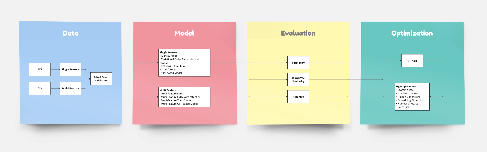

# SeqLab

Welcome to **SeqLab**! This project provides a comprehensive framework for training and evaluating various machine learning models, focusing on multi-feature sequential categorical data.

## Table of Contents
1. [Introduction](#introduction)
2. [Key Features](#key-features)
3. [Getting Started](#getting-started)
    - [Installation](#installation)
    - [Data Representation](#data-representation)
    - [Configuration](#configuration)
    - [Running the Experiment](#running-the-experiment)
    - [Monitoring the Experiment](#monitoring-the-experiment)
4. [Full Documentation](#full-documentation)

## Introduction

**SeqLab** is engineered to facilitate systematic experimentation and benchmarking of machine learning models. Utilizing a configuration-driven approach, researchers and practitioners can specify their experimental setups through a JSON file, ensuring reproducibility and flexibility. The project integrates seamlessly with MLflow, providing robust tools for experiment tracking and model management.

SeqLab is optimized for training models that perform sequence modeling and next-step prediction. For example, consider a sequence of musical chords:

```
A:min E:min F:maj G:maj A:min C:maj G:maj
```

SeqLab enables the development of models that learn from such sequences and predict the subsequent chord in the progression. This capability is essential for applications in areas such as music generation and sequence prediction in natural language processing.



### Key Features

- **Multiple Model Support**
  - **Markov**
  - **Variable-Order Markov**
  - **LSTM**
  - **LSTM with Attention**
  - **Transformer**
  - **GPT** 
- **Multi-feature Sequential Categorical Data Handling**
- **Automated Hyperparameter Optimization with [Optuna](https://github.com/optuna/optuna)**
- **Experiment Tracking with [MLflow](https://github.com/mlflow/mlflow)**

## Getting Started

### Installation

To get started, set up a virtual environment with Python 3.11 and install the necessary dependencies:

1. **Set up the virtual environment**:
    ```bash
    python3.11 -m venv venv
    source venv/bin/activate  # On Windows, use `venv\Scripts\activate`
    ```

2. **Install the required dependencies**:
    ```bash
    pip install -r requirements.txt
    ```

Use the provided example configuration file, which includes all available models and hyperparameters. You can customize this example by selecting the configurations that interest you and copying them into your `config.json` file: [example-config.json](example-config.json).

### Data Representation

Seqlab accepts data in two formats:

1. **TXT Format**:
   - Ideal for single feature/dimension data.
   - Each sequence should be represented in a row with space-separated values.
   - Example:
    ```
    A B C D E
    F G H I J
    ```

2. **CSV Format**:
   - Supports multiple features/dimensions.
   - Features are tab-separated, with sequences separated by rows containing the `>*` symbol.
   - The first line should contain feature names, with each subsequent row representing an event in time. The rows between the separator rows (`>*`) represent sequences.
   - Example:
    ```
    feature1    feature2    feature3
    A           1           x
    B           2           y
    C           3           z
    >*
    D           4           u
    E           5           v
    F           6           w
    >*
    ```
### Configuration

After preparing your data, place it in a designated folder (e.g., `data` folder) and add its path to the list of datasets in the experiment configuration file. Next, configure the following settings:
- **Number of splits for k-fold cross-validation**: Default is 7.
- **Number of trials for model fine-tuning**: Default is 20.

### Running the Experiment

To start the experiment, execute the following command:

```bash
python run.py
```

### Monitoring the Experiment

To monitor the experiment process, start the MLflow UI in another terminal:

```bash
mlflow ui --port=4000
```

Then, navigate to 127.0.0.1:4000 in your web browser to access the MLflow tracking UI.


*Figure: Visualizing experiment tracking with MLflow in SeqLab. Each experiment set is named after its dimensionality and contains multiple models. Each model is evaluated using different folds of data, with multiple trials per fold to optimize hyperparameters. The MLflow UI stores metrics, evaluation results, and important experiment tags for each run, allowing detailed analysis and comparison of model performance.*


### Full Documentation
For comprehensive details and advanced usage, please refer to the full documentation available [here](doc/).

